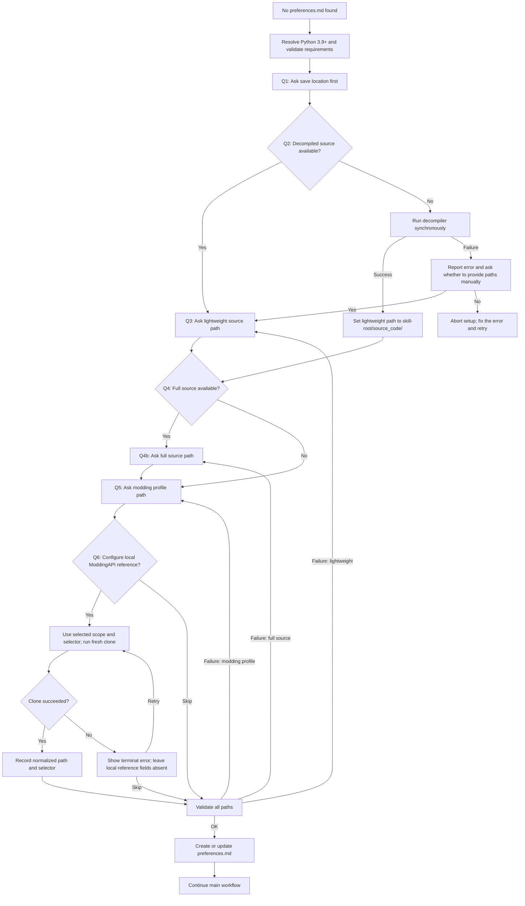

# First-Time Setup

## Overview

When no `preferences.md` is found, this reference describes preference-setup flow.

Shared [Invocation preflight](invocation-preflight.md) reference owns blocking gate, preference precedence, tracked-session stop exception, path recovery, and completion contract. This reference owns detailed setup questions, validation, and save operations after that gate selects missing-preferences state.

Before executing command in this reference, agent MUST apply command-context contract in [Invocation preflight](invocation-preflight.md).

Agent MUST ask only questions in this setup flow, MUST save `preferences.md`, and MUST continue only after those steps complete.

Before asking Q1, agent MUST complete the [Python runtime gate](python-runtime.md). Q1 remains the first user question. A failed runtime gate MUST stop setup, show its stable configuration diagnostic, and provide the retry action; it MUST NOT install packages or write `preferences.md`.

On success, agent MUST return validated preferences file to Invocation preflight completion check. On failure, agent MUST report error and retry path through that same contract.

## Setup Flow



## AskUserQuestion Questions

**Language of AskUserQuestion Questions**: agent SHOULD attempt to use user's input language or language preference of editor/cli they're using when asking questions.
- This means agent SHOULD attempt to translate questions' header, question, options, etc. agent SHOULD NEVER translate user input or any file, path, etc.
- Agent SHOULD default to English only when user's input language is not available.

Agent MUST use AskUserQuestion with **ALL applicable** questions in **ONE** call:
- If Q2 is "Yes", agent MUST ask Q1 + Q2 + Q3 + Q4 + Q5 + Q6 in one call; Q4b and selector details are conditional inputs.
- If Q2 is "No", agent MUST ask Q1 + Q2 + Q4 + Q5 + Q6 in one call; Q3 is auto-filled, and Q4b and selector details are conditional inputs.

### Q1: Save Location

```yaml
header: "Save"
question: "Where to save preferences?"
options:
  - label: "User (Recommended)"
    description: "User scope; see preferences-schema.md#approved-local-reference-locations — available across projects"
  - label: "Project"
    description: "Project scope; see preferences-schema.md#approved-local-reference-locations — scoped to this repository"
```

Note: Agent MUST ask this first so auto-write for decompile branch knows destination.

### Q2: Decompiled Source Branch

```yaml
header: "decompiled source"
question: "Do you have decompiled Blasphemous source code?"
options:
  - label: "No (run decompiler)"
    description: "Automatically decompile game DLLs from Steam installation"
  - label: "Yes"
    description: "I already have decompiled source code, I will provide paths"
```

- When user selects **No**, agent MUST run decompile script synchronously:
  - **Windows**: `& (Join-Path $SkillRoot 'scripts\decompile_source.ps1')`
  - **macOS/Linux**: `bash "$SKILL_ROOT/scripts/decompile_source.sh"`
  On success, `lightweight_source_code_path` is auto-filled to `<skill-root>/source_code/`. On failure, agent MUST prompt user whether to provide paths manually.
- When user selects **Yes**, agent MUST enter manual path flow.

### Q3: Lightweight Source Code Path

```yaml
header: "lightweight source code path"
question: "Where is your lightweight source code of decompiled Blasphemous project's core files?"
options: a user-input path
```

Note:
- This is **MINIMUM required field**. At least lightweight MUST be set.
- For decompile branch (Q2 = No), this path is auto-determined — agent MUST skip this question.

### Q4: Full Source Code (optional)

```yaml
header: "full source needed"
question: "Do you also have full decompiled Blasphemous source code (.sln with all projects)?"
options:
  - label: "Yes"
    description: "Provide full source code path"
  - label: "No"
    description: "Skip full source code, proceed with lightweight source only"
```

Note: Agent MUST ask this only if lightweight source code is already provided (manually or via decompile). This field is purely optional.

### Q4b: Full Source Code Path (conditional)

```yaml
header: "full source code path"
question: "Where is your full source code of decompiled Blasphemous project?"
options: a user-input path
```

Note: Agent MUST ask this only if user answered "Yes" to Q4.

### Q5: Modding Profile Path

```yaml
header: "modding profile path"
question: "Where is your Blasphemous modding profile root path?"
options: a user-input path
```

Note: This path MUST be entered manually in all branches. modding profile is typically full game copy, not part of original game installation, so it cannot be auto-detected from game path.

### Q6: Local ModdingAPI Reference

```yaml
header: "local ModdingAPI reference"
question: "Configure a local ModdingAPI reference checkout?"
options:
  - label: "Yes (Recommended)"
    description: "Clone a shallow, reproducible checkout and save its absolute path and selector in preferences.md"
  - label: "Skip"
    description: "Leave local reference fields absent and use the release-aware remote fallback"
```

If user selects **Yes**, agent MUST use same scope selected in Q1.
Agent MUST NOT select independent reference scope: agent MUST keep
local reference and its preferences in same scope domain. approved paths are authoritative in
[preferences-schema.md#approved-local-reference-locations](preferences-schema.md#approved-local-reference-locations).

```yaml
header: "reference selector"
question: "Which ModdingAPI reference should be cloned?"
options:
  - label: "latest (Recommended)"
    description: "Newest non-draft, non-prerelease GitHub Release"
  - label: "Exact tag"
    description: "Reproduce a named Release tag with tag:REF"
  - label: "Explicit branch or commit"
    description: "Use branch:REF or commit:SHA for deliberate development or source pinning"
```

For **Exact tag**, agent MUST collect tag name and pass `tag:REF`.
For explicit branch or commit, agent MUST collect branch name or
40-character SHA and pass `branch:REF` or `commit:SHA`. `latest` needs no
additional value.

Agent MUST run matching fresh-clone command from caller's Mod repository using explicit Skill-root path:

```bash
bash "$SKILL_ROOT/scripts/clone_modding_api.sh" --scope user --selector latest
```

```powershell
& (Join-Path $SkillRoot 'scripts\clone_modding_api.ps1') -Scope user -Selector latest
```

Agent MUST use `--scope project` / `-Scope project` when Q1 selected
Project and MUST use User when Q1 selected User. clone command refuses existing target, uses shallow history by default, checks out
tags and commits detached, creates tracking branch for explicit branches,
writes normalized absolute path plus selector to selected
`preferences.md`, and writes sibling lock state described in
[preferences-schema.md#sibling-lock-state](preferences-schema.md#sibling-lock-state).
It does not replace existing checkout.

## Validate User Input

Agent MUST validate whether user-input paths exist and are valid using command-line tools.

Validation criteria:
- All branches:
  - `lightweight_source_code_path` **MUST** exist — validate that root path exists; it SHOULD ideally contain `.sln` file
  - `full_source_code_path` (if provided) — validate that root path exists; it SHOULD ideally contain `.sln` file
  - `modding_profile_path` (if provided) — it SHOULD contain `Blasphemous.exe` and `Modding` folder
  - When Q6 is enabled, local ModdingAPI reference parent MUST be writable, and fresh-clone target MUST NOT already exist.
- If any check fails, agent MUST return to **corresponding single question** (not entire flow):
  - Lightweight fail → retry Q3 only
  - Full fail (if provided) → retry Q4b only
  - Modding profile fail → retry Q5 only
- Decompile branch: script exit code 0 validates lightweight automatically

**Script failure handling** (Q2 = No, script exit code != 0):
1. Agent MUST display script's error output to user.
2. Agent MUST ask: "Decompilation failed. Would you like to provide source paths manually instead?"
   - Yes → agent MUST enter manual path flow at Q3 (lightweight).
   - No → agent MUST abort setup and instruct user to resolve error and retry.

**Local reference failure handling** (Q6 = Yes, clone exit code != 0):
1. Agent MUST display clone command's terminal error report.
2. Agent MUST NOT write or update `modding_api_reference_path` or `modding_api_reference_selector`.
3. Agent MUST ask user whether to retry with corrected selector or path; selecting Skip leaves release-aware remote fallback enabled.

## Save Locations

Agent MUST use approved preferences and local-reference paths in
[preferences-schema.md#approved-local-reference-locations](preferences-schema.md#approved-local-reference-locations).

## Setup Workflow After User-questions

1. Agent MUST create directory if needed.
2. Agent MUST write or update `preferences.md` with selected values, preserve unknown and legacy fields, and add `modding_api_reference_path` and `modding_api_reference_selector` only when Q6 is enabled and clone succeeds.
3. If Q6 was skipped, agent MUST leave both local reference fields absent.
4. Agent MUST confirm: "Preferences saved to [path], you can edit it by yourself at any time."
5. Agent MUST continue main agent workflow using saved preferences.

## `preferences.md` Template

Agent MUST read [preferences-schema.md](preferences-schema.md) for detailed template restrictions.

## Modifying Preferences Later

Users can edit `preferences.md` directly or delete it to trigger setup again.
